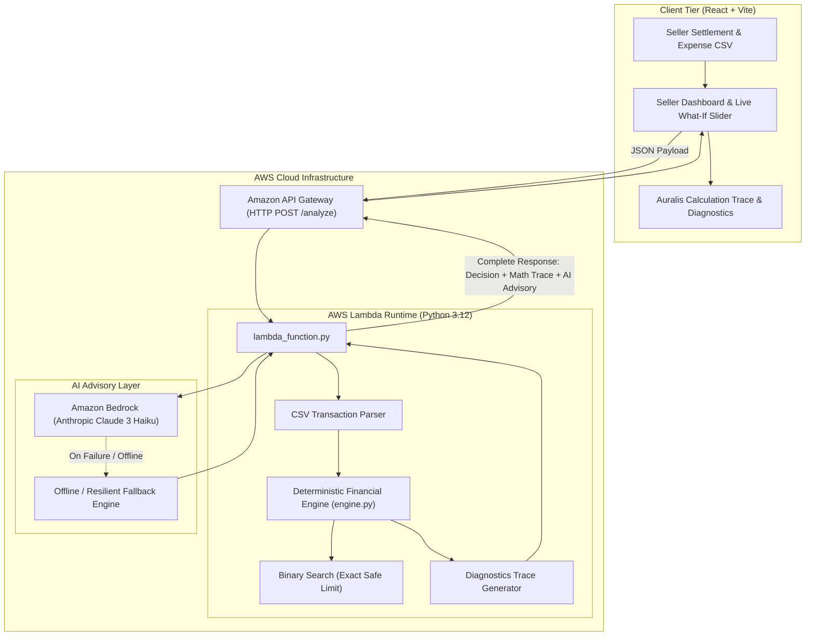

# 🛡️ BuySafe: AI Inventory Purchase Safety Engine

> **Submitted to WeMakeDevs First Commit Hackathon**  
> *Deterministic Financial Decision Engine + Amazon Bedrock Executive Advisory for Amazon E-Commerce Sellers.*

[](#)
[](#)
[](#)
[](#)

---

## ⚡ The 10-Second Pitch

> **"I have ₹1,42,000 in cash. Can I safely spend ₹80,000 on inventory today?"**

Most Amazon sellers make inventory purchasing decisions on intuition or static spreadsheets, leading to **fatal cash-flow bottlenecks** when supplier invoices, Amazon ad spend, and warehouse fees come due before the next payout clears.

**BuySafe answers this in under 3 seconds with mathematical certainty:**
1. Evaluates upcoming payouts and operational outflows.
2. Yields a strict, deterministic **SAFE** or **DON'T BUY** decision.
3. Calculates the exact **Maximum Safe Purchase** (via integer binary search).
4. Generates an auditable, step-by-step **Calculation Trace** (Auralis Diagnostics).
5. Synthesizes a natural-language executive advisory via **Amazon Bedrock (Claude 3 Haiku)**.

---

## 🏛️ System Architecture

### Core Principle: "The Engine Decides. AI Explains."
BuySafe never delegates financial calculations or risk verdicts to an LLM. The financial engine is 100% deterministic (Python standard library only). If Amazon Bedrock is throttled or offline, **decisions, bounds, and traces remain 100% functional.**

### Mermaid Architecture Diagram



### ASCII Architecture

```text
[Seller CSV Data] + [Current Cash: ₹1.42L] + [Reserve: ₹60k] + [Order: ₹80k]
                                  │
                                  ▼
                   [Amazon API Gateway (HTTP POST /analyze)]
                                  │
                                  ▼
                [AWS Lambda: Deterministic Python Engine]
               ┌──────────────────┴──────────────────┐
               ▼                                     ▼
      [Cash Flow Timeline]                 [Binary Search Solver]
     (Inflows vs Expenses)                 (Exact Max Safe Order)
               │                                     │
               └──────────────────┬──────────────────┘
                                  ▼
                [Auralis Diagnostics & Ledger Trace]
             (Lowest Cash Floor: ₹86,000 ≥ ₹60,000 Reserve)
                                  │
                   ┌──────────────┴──────────────┐
                   ▼                             ▼
       [Deterministic Verdict]          [Amazon Bedrock]
        STATUS: SAFE TO BUY       (Claude 3 Haiku Advisory)
        Max Safe: ₹1,06,000            (Graceful Fallback)
                   │                             │
                   └──────────────┬──────────────┘
                                  ▼
                 [React Dashboard & Inspection Modal]
```

---

## 🎯 Verified Demo Scenarios (Judge-Proof Test Cases)

Every scenario below is mathematically validated in `backend/test_scenarios.py`:

```bash
python backend/test_scenarios.py
```

### Scenario 1: Clearly Safe
- **Inputs:** Current Cash: `₹2,00,000` | Reserve: `₹50,000` | Purchase: `₹20,000`
- **Engine Output:**
  - Status: **`SAFE`**
  - Minimum Cash Floor: `₹2,00,000` (Buffer remaining: `+₹1,50,000`)
  - Maximum Safe Purchase: `₹1,74,000`
  - Earliest Safe Date: `Today`

### Scenario 2: Clearly Unsafe
- **Inputs:** Current Cash: `₹1,00,000` | Reserve: `₹60,000` | Purchase: `₹80,000`
- **Engine Output:**
  - Status: **`DON'T BUY` (UNSAFE)**
  - Minimum Cash Floor: `₹44,000`
  - Shortfall Deficit: `₹16,000` below safety reserve
  - Earliest Safe Date: `2026-09-28` (when incoming payout of ₹58,000 arrives)

### Scenario 3: Boundary Precision (Integer Exactness)
- **Inputs:** Current Cash: `₹1,42,000` | Reserve: `₹60,000`
- **Engine Solved Max Safe:** `₹1,06,000`
- **Test at boundary:**
  - Purchase = **`₹1,06,000`** ➔ Status: **`SAFE`** (Projected Cash Floor = `₹60,000.00`)
  - Purchase = **`₹1,06,001`** ➔ Status: **`DON'T BUY`** (Projected Cash Floor = `₹59,999.00`)
- **Judge Value:** Demonstrates exact threshold calculation, not approximate rounding.

### Scenario 4: Different CSV (Heavy Front-Loaded Expenses)
- **Inputs:** Current Cash: `₹1,20,000` | Reserve: `₹25,000` | Purchase: `₹20,000`
- **Data:** CSV with ₹90,000 in emergency supplier payments due before Oct 15 payout.
- **Engine Output:**
  - Status: **`DON'T BUY` (UNSAFE)**
  - Max Safe Order Today: Only `₹5,000`
  - Earliest Safe Date: Dynamically calculated as `2026-10-15`

### Scenario 5: AI Failure Resilience (Bedrock Offline)
- **Simulation:** Bedrock runtime client disabled / network timeout / invalid credentials.
- **Engine Output:**
  - Decision: **`SAFE / DON'T BUY` fully generated with 100% precision.**
  - Fallback Advisory: High-fidelity structured financial narrative populated from deterministic metrics.
  - Zero application downtime.

---

## 🔍 Calculation Trace (Auralis Diagnostics Panel)

When clicking **"🤖 Why? (AI Breakdown & Math Trace)"** on the dashboard, judges and users inspect:

1. **Safety Rule Verification:**
   $$\text{Cash Floor} \ge \text{Reserve Threshold}$$
2. **Key Metric Summary:** Starting Cash, Applied Order, Safety Trough, and Max Safe Limit.
3. **Step-by-Step Execution Ledger Table:**
   - Sequential audit of every payout, ad fee, storage expense, and purchase deduction.
   - Highlights the exact **Trough Date** where liquidity is most vulnerable.
4. **Copyable Trace JSON / Audit Log** for enterprise compliance.

---

## 🚀 AWS Serverless Deployment Guide

No DynamoDB or complex multi-service configuration required. Clean serverless setup takes **< 10 minutes**.

### Step 1: Deploy AWS Lambda Function

1. Log into **AWS Console** ➔ Navigate to **AWS Lambda** ➔ **Create function**.
2. **Settings**:
   - Function name: `buysafe-analyzer`
   - Runtime: `Python 3.12`
   - Architecture: `x86_64`
3. In **Code Source**, click **Upload from** ➔ **.zip file**.
4. Select `lambda-deployment.zip` (included in repository root).
5. Under **Runtime settings**, verify Handler is:
   ```text
   lambda_function.lambda_handler
   ```
6. Under **Configuration ➔ General configuration**:
   - Memory: `256 MB`
   - Timeout: `15 seconds`
7. *(Optional for Bedrock)* Under **Configuration ➔ Permissions**, attach `AmazonBedrockFullAccess` or inline policy:
   ```json
   {
     "Version": "2012-10-17",
     "Statement": [
       {
         "Effect": "Allow",
         "Action": "bedrock:InvokeModel",
         "Resource": "arn:aws:bedrock:*::foundation-model/anthropic.claude-3-haiku-20240307-v1:0"
       }
     ]
   }
   ```

### Step 2: Create Amazon API Gateway (HTTP API)

1. Navigate to **API Gateway** ➔ **Create API** ➔ **HTTP API** ➔ Click **Build**.
2. **Name**: `buysafe-api`.
3. Add Integration: Choose **Lambda**, select `buysafe-analyzer`.
4. **Configure Routes**:
   - Method: `POST` | Resource Path: `/analyze`
   - Method: `GET` | Resource Path: `/health`
5. Enable **CORS**:
   - Access-Control-Allow-Origin: `*`
   - Access-Control-Allow-Methods: `POST, GET, OPTIONS`
   - Access-Control-Allow-Headers: `Content-Type`
6. Click **Deploy**. Note your Invoke URL:
   ```text
   https://<api-id>.execute-api.<region>.amazonaws.com/analyze
   ```

### Step 3: Deploy Frontend (AWS Amplify or S3 + CloudFront)

```bash
cd frontend
npm install
npm run build
```
Deploy the generated `frontend/dist` folder to:
- **AWS Amplify Hosting** (drag and drop `dist/`), OR
- **Amazon S3 Static Website Hosting** behind CloudFront.

Set `API_URL` in `src/App.jsx` to your deployed API Gateway endpoint.

---

## 🛡️ Hackathon Auto-Pay & Cost Protection Guide

To guarantee zero surprise bills during hackathon evaluation:

### 1. Zero-Spend AWS Budget Alert ($1.00 USD Cap)
1. Go to **AWS Billing and Cost Management** ➔ **Budgets**.
2. Click **Create budget** ➔ **Cost budget (Recommended)**.
3. Set Budget Amount: **Fixed** ➔ `$1.00`.
4. Set Alert Threshold: **80% ($0.80)** and **100% ($1.00)**.
5. Enter your email for immediate notification.

### 2. Lambda Concurrency Cap (Throttling Protection)
Prevents DDoS or accidental loop invocations:
1. In Lambda function `buysafe-analyzer` ➔ **Configuration** ➔ **Concurrency**.
2. Click **Edit** ➔ Select **Reserve concurrency** ➔ Set to `5`.
3. This guarantees maximum possible simultaneous executions is capped at 5.

### 3. Bedrock Token Limitation
In `backend/bedrock.py`:
- `max_tokens` is hard-limited to `512` tokens per evaluation (~$0.00015 per call on Claude 3 Haiku).
- Zero fine-tuning or provisioned throughput needed (uses on-demand pricing).

---

## 💻 Local Quickstart

### 1. Run Backend Server (Port 8000)
```bash
python backend/server.py
```

### 2. Run Frontend Dev Server (Port 5173)
```bash
cd frontend
npm install
npm run dev
```

Open [http://localhost:5173](http://localhost:5173) in your browser.

---

## ⚖️ License
MIT License. Built for WeMakeDevs First Commit Hackathon.
