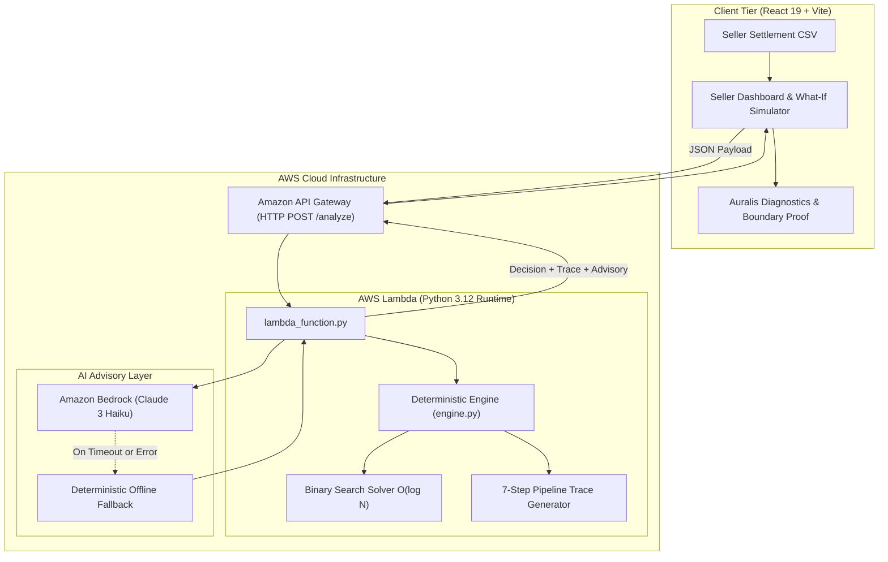

# 🛡️ BuySafe: Deterministic Financial Safety Engine

> **Submitted to WeMakeDevs First Commit Hackathon**  
> *Deterministic Financial Decision Engine + Amazon Bedrock Executive Advisory for Amazon Sellers.*

[](#)
[-blue)](#)
[](#)
[-purple)](#)
[](#)
[](#)

---

## ⚡ The 30-Second Judge Hook: The ₹1 Mathematical Boundary Proof

Most hackathon fintech projects rely on LLM prompts to estimate risk ("*Based on your balance, this seems risky...*"), leading to mathematical hallucinations and unreliable decisions.

**BuySafe does the exact opposite.** Calculations are 100% deterministic (Python 3.12 integer binary search). We prove this with **₹1 integer boundary precision**:

```text
Cash: ₹1,42,000 | Reserve Floor: ₹60,000 | Amazon Payouts & Expenses over 30 Days

✦ Purchase = ₹1,06,000 ➔ Projected Cash Floor: ₹60,000.00 ➔ SAFE TO BUY (Buffer: ₹0)
✕ Purchase = ₹1,06,001 ➔ Projected Cash Floor: ₹59,999.00 ➔ DON'T BUY   (Shortfall: ₹1)
```

> **Try it yourself in the UI:** Click **`🎯 Engine Proof`** in the top navigation or on the Maximum Safe Purchase card. You can click **`[Test ₹X]`** and **`[Test ₹X+1]`** to watch the entire dashboard flip from **SAFE TO BUY** to **DON'T BUY** on exactly one rupee.

---

## 🏛️ Architectural Principle: *"The Engine Decides. AI Explains."*

```text
┌──────────────────────────────────────────────────────────────────────────────────┐
│                             THE ENGINE DECIDES (0.4ms)                           │
│  • AWS Lambda / Python 3.12 (Standard Library Only)                              │
│  • 30-Day Day-by-Day Cash Flow Simulation                                        │
│  • Integer Binary Search Solver: O(log N) to exact ₹1                            │
│  • 0% AI Math Hallucination Risk • 100% Deterministic Reproducibility             │
└────────────────────────────────────────┬─────────────────────────────────────────┘
                                         │  Verified Decision + Metrics
                                         ▼
┌──────────────────────────────────────────────────────────────────────────────────┐
│                              AI EXPLAINS (Amazon Bedrock)                        │
│  • Anthropic Claude 3 Haiku via Amazon Bedrock                                   │
│  • Role: Executive communication, seller context, risk narrative                 │
│  • Zero calculation power: Claude is never asked to compute balances or limits    │
│  • Resilience: If Bedrock is offline/throttled, Engine executes 100% gracefully  │
└──────────────────────────────────────────────────────────────────────────────────┘
```

---

## 🧭 60-Second Judge Quickstart

### 1. Run Automated Engine Test Suite (5 Scenarios)
Verify all mathematical proofs in under 2 seconds:
```bash
python backend/test_scenarios.py
```
*Expected Output: `ALL 5 CORE SCENARIO TESTS PASSED PERFECTLY!`*

### 2. Launch Local Dev Environment
```bash
# Terminal 1: Backend Engine API (Port 8000)
python backend/server.py

# Terminal 2: Frontend Dashboard (Port 5173)
cd frontend
npm install
npm run dev
```
Open **[http://localhost:5173](http://localhost:5173)** in your browser.

### 3. What to Test in 3 Clicks:
1. **Interactive Slider:** Drag the "Proposed Purchase" slider past the solved threshold. Watch the decision transition from **`SAFE TO BUY`** (emerald) to **`DON'T BUY`** (rose) with real-time liquidity curve updates.
2. **`🎯 Engine Proof` Button (Top Nav):**
   - **Lens 1 (Boundary Proof):** See the live side-by-side ₹1 proof card.
   - **Lens 2 (7-Step Pipeline):** Click **`[▶ Replay Engine Decision]`** to watch the engine sequentially execute inputs verification, transaction parsing, trajectory forecast, and binary search solving.
   - **Lens 3 (Why Did It Fail?):** Shows the exact drainage sequence down to the shortfall and root risk drivers.
   - **Lens 4 (Decision Basis & Integrity):** Demonstrates zero AI math hallucination and 0.4ms engine latency.
   - **Lens 5 (Sequential Ledger):** Full 30-day chronological accounting table highlighting the liquidity trough date.
3. **`⚡ Quick Check` Mode:** Switch to 3-slider instant check mode to test arbitrary cash, reserve, and order amounts without uploading a CSV.
4. **`📋 Export Report`:** Generate and print/download an official, audit-ready Financial Safety Memorandum.

---

## ⚙️ The 7-Step Deterministic Execution Pipeline

Every evaluation follows an auditable 7-step pipeline exposed in the **Engine Debugger**:

| Step | Phase | Implementation Detail |
|---|---|---|
| **Step 1** | **Inputs Verified** | Validates `current_cash ≥ 0`, `reserve_threshold ≥ 0`, `purchase_amount ≥ 0`. |
| **Step 2** | **Transactions Parsed** | Normalizes settlement inflows, supplier expenses, ad fees, and platform deductions. |
| **Step 3** | **Cash Forecast Built** | Computes running day-by-day cash balance across a 30-day projection horizon. |
| **Step 4** | **Safety Constraint Applied** | Verifies inequality: $\text{Min Projected Cash} \ge \text{Reserve Threshold}$. |
| **Step 5** | **Boundary Solved** | Integer binary search $O(\log N)$ computes the exact Maximum Safe Purchase. |
| **Step 6** | **Decision Generated** | Outputs verdict, safety buffer or shortfall, primary risk driver, and alternative actions. |
| **Step 7** | **AI Explained** | Amazon Bedrock synthesizes executive advisory (with instant rule-based fallback). |

---

## 🎯 The 5 Verified Test Scenarios

All 5 scenarios are verified both in automated unit tests (`backend/test_scenarios.py`) and live in the frontend demo personas:

### Scenario 1: Clearly Safe
- **Parameters:** Cash: `₹2,00,000` | Reserve: `₹50,000` | Proposed PO: `₹20,000`
- **Result:** **`SAFE TO BUY`**
- **Metrics:** Min cash floor: `₹2,00,000` (Buffer: `+₹1,50,000`) | Max Safe Purchase: `₹1,74,000`.

### Scenario 2: Clearly Unsafe
- **Parameters:** Cash: `₹1,00,000` | Reserve: `₹60,000` | Proposed PO: `₹80,000`
- **Result:** **`DON'T BUY`**
- **Metrics:** Min cash floor: `₹44,000` (Shortfall: `₹16,000` below safety floor) | Recovery Date: `2026-09-28`.

### Scenario 3: Boundary Precision (₹1 Exact Sensitivity)
- **Parameters:** Cash: `₹1,42,000` | Reserve: `₹60,000`
- **Engine Solved Max Safe:** `₹1,06,000`
- **Boundary Verification:**
  - `Purchase = ₹1,06,000` ➔ Status: **`SAFE`** (Min Cash: `₹60,000.00`, Buffer: `₹0`)
  - `Purchase = ₹1,06,001` ➔ Status: **`DON'T BUY`** (Min Cash: `₹59,999.00`, Shortfall: `₹1`)

### Scenario 4: Dynamic CSV Reshaping (Heavy Front-Loaded Expenses)
- **Parameters:** Cash: `₹1,20,000` | Reserve: `₹25,000` | Proposed PO: `₹20,000`
- **Data:** CSV with ₹90,000 in emergency supplier payments due before mid-month payout.
- **Result:** **`DON'T BUY`** | Max Safe Today: `₹5,000` | Safe Date: `2026-10-15`.

### Scenario 5: AI Failure Resilience (Bedrock Offline / Outage Simulation)
- **Simulation:** Toggle "Bedrock Offline" or disconnect internet.
- **Result:** **`100% Operational`**. Engine evaluates safety, binary search solves maximum limit, and rule-based fallback advisory generates full narrative with zero downtime.

---

## 🚀 AWS Serverless Cloud Architecture

BuySafe is built for frictionless AWS serverless deployment with **zero database overhead**:



### AWS Deployment in Under 10 Minutes:
1. **Lambda:** Upload `lambda-deployment.zip` (Python 3.12, 256MB memory, 15s timeout).
2. **Permissions:** Attach `AmazonBedrockFullAccess` to Lambda execution role.
3. **API Gateway:** Create HTTP API with `POST /analyze` route pointing to Lambda.
4. **Frontend:** Host `frontend/dist` on AWS Amplify Hosting or S3 + CloudFront.

---

## 🛡️ Hackathon Auto-Pay & Cost Protection

To ensure **$0 surprise AWS bills** during hackathon evaluation:
- **Zero-Spend AWS Budget Alert:** Hard cap alert set at **$1.00 USD**.
- **Lambda Concurrency Cap:** Reserved concurrency limited to `5` simultaneous executions (DDoS protection).
- **Bedrock Token Limit:** Claude 3 Haiku calls capped at `512` output tokens (~$0.00015 per evaluation).
- **No Idle Costs:** Zero provisioned instances, zero persistent databases.

---

## 📁 Repository Structure

```text
buysafe/
├── backend/
│   ├── engine.py           # Core deterministic cash-flow engine & binary search solver
│   ├── bedrock.py          # Amazon Bedrock Claude 3 Haiku client with fallback
│   ├── server.py           # Local FastAPI/Starlette development server (Port 8000)
│   ├── lambda_function.py  # AWS Lambda production handler
│   └── test_scenarios.py   # Automated test suite for all 5 scenarios
├── frontend/
│   ├── src/
│   │   ├── App.jsx                 # Bento grid dashboard with slider & reference markers
│   │   ├── EngineDebuggerModal.jsx # Auralis Diagnostics, ₹1 Proof, & Replay Animator
│   │   ├── DecisionReportModal.jsx # Official printable memorandum exporter
│   │   ├── ActionRecommendations.jsx# "What should I do instead?" action cards
│   │   ├── VisualWaterfall.jsx     # Liquidity waterfall decomposition
│   │   ├── StressTestMatrix.jsx    # Scenario stress-testing grid
│   │   ├── EventTimeline.jsx       # Chronological transaction feed
│   │   ├── LandingPage.jsx         # 3D cinematic landing page (Zero hardcoded numbers)
│   │   ├── Login.jsx               # Seller authentication & persona switcher
│   │   ├── sellers.js              # 3 realistic demo Amazon seller profiles
│   │   └── App.css                 # Premium dark fintech design system
│   ├── package.json
│   └── vite.config.js
├── sample_seller.csv       # Default Amazon seller dataset (settlements & fees)
├── lambda-deployment.zip   # Ready-to-deploy AWS Lambda deployment bundle
└── README.md
```

---

## ⚖️ License
MIT License. Submitted to **WeMakeDevs First Commit Hackathon**.
